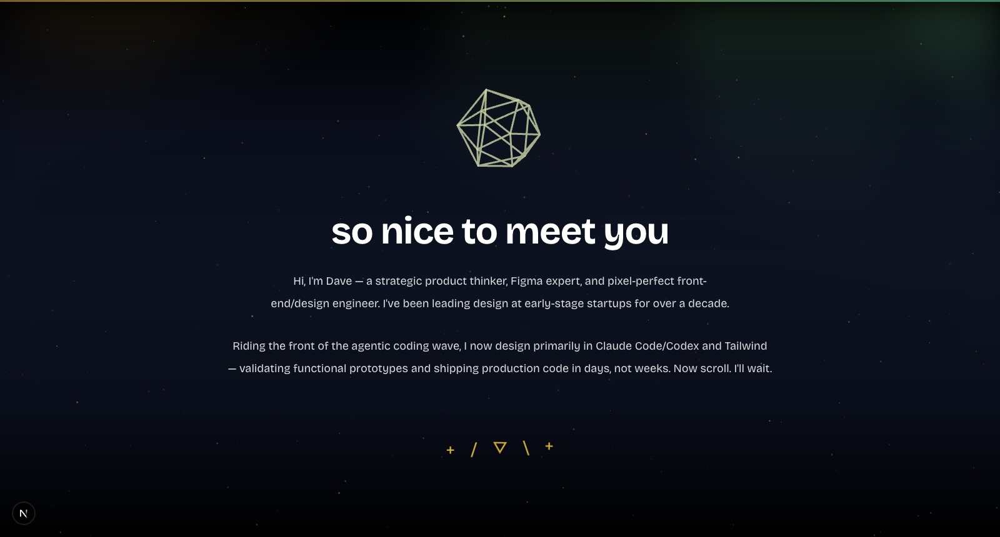

# kidastro.com

[](https://kidastro.com)

Dave Keller's portfolio and resume — a Figma expert and front-end/design engineer riding the front of the agentic coding wave: designing primarily in Claude Code, Codex, and Tailwind, validating functional prototypes and shipping production code in days, not weeks. Built with Next.js and shipped as a static site.

**Live at [kidastro.com](https://kidastro.com)** · [resume](https://kidastro.com/resume) · [the arcade](https://kidastro.com/games)

## Stack

- **Next.js** (App Router) with `output: 'export'` — static export to `./out`
- **React**, **TypeScript**, **Tailwind CSS**
- **Framer Motion** for animation
- Fonts: **Inter** + **Bricolage Grotesque** via `next/font`

## Develop

```bash
npm install
npm run dev
```

Then open [http://localhost:3000](http://localhost:3000).

Copy lives in the components — see [`docs/copy-voice-guide.md`](docs/copy-voice-guide.md) for the voice and where each surface's text lives.

## Build

```bash
npm run build
```

`prebuild` bundles the Claude Code skills into `public/downloads/` first, then Next exports the static site to `./out`.

## Deploy

Pushes to `main` deploy to **GitHub Pages** via `.github/workflows/deploy.yml` (custom domain: [kidastro.com](https://kidastro.com)). Feature branches don't deploy — open a PR and merge to ship.
